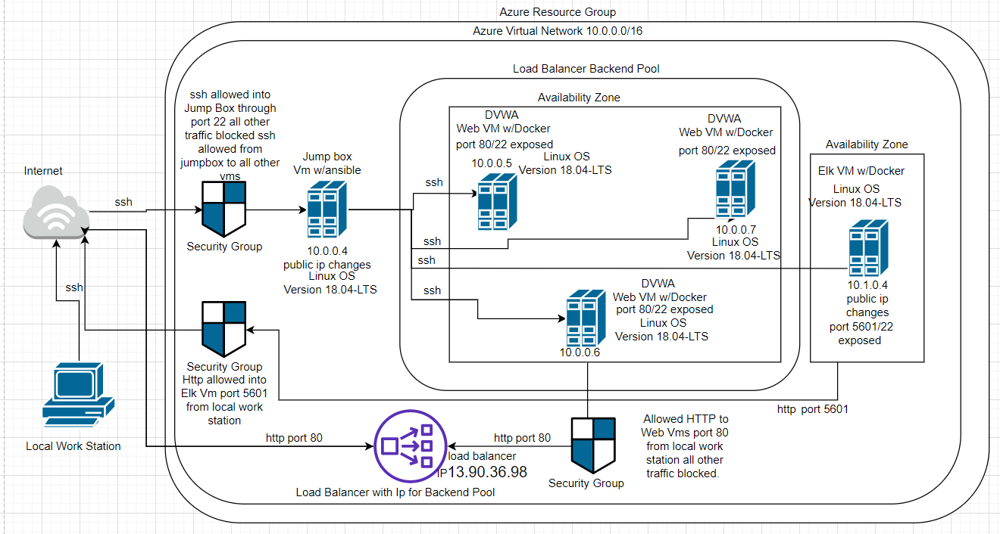

# Project-1-Cybersecurity-BC
First project for UC Davis Cybersecurity Bootcamp
## Automated ELK Stack Deployment

The files in this repository were used to configure the network depicted below.

These files have been tested and used to generate a live ELK deployment on Azure. They can be used to either recreate the entire deployment pictured above. Alternatively, select portions of the ansible yaml file may be used to install only certain pieces of it, such as Filebeat.

 

This document contains the following details:
- Description of the Topologu
- Access Policies
- ELK Configuration
  - Beats in Use
  - Machines Being Monitored
- How to Use the Ansible Build

### Description of the Topology

The main purpose of this network is to expose a load-balanced and monitored instance of DVWA, the D*mn Vulnerable Web Application.

Load balancing ensures that the application will be highly protected from DOS attacks, in addition to restricting bots access to the network.
- Load Balancers protect the network layer of security. Prohibiting large ammounts of requests/traffic to the network, and also balancing traffic through multiple servers. This protects against DOS attacks. The benefit of having a load balancer speaks for itself, and adding a Jumpbox to have access to the web servers increases the security (by limiting direct access into the web vms). Puting a load balancer on the web vms creates an external Ip that only the internet can access. While allowing a Jumpbox access to the servers, this limits the risk of infiltration. 

Integrating an ELK server allows users to easily monitor the vulnerable VMs for changes to the logs and system metrics.
- Filebeat monitors the log data and forwards it to the Logstash.
- Metricbeat monitors the systems metrics. It monitors the server by collecting metrics from the system and other services running on the server.

The configuration details of each machine may be found below.
_Note: Use the [Markdown Table Generator](http://www.tablesgenerator.com/markdown_tables) to add/remove values from the table_.

| Name     | Function     | IP Address | Operating System |
|----------|--------------|------------|------------------|
| Jump Box | Gateway      | 10.0.0.4   | Linux            |
| Web Vm 1 |DVWA Container| 10.0.0.5   | Linux            |
| Web Vm 2 |DVWA Container| 10.0.0.6   | Linux            |
| Web Vm 3 |DVWA Container| 10.0.0.7   | Linux            |

### Access Policies

The machines on the internal network are not exposed to the public Internet. 

Only the ELK machine can accept connections from the Internet. Access to this machine is only allowed from the following IP addresses:
- 67.174.39.194

Machines within the network can only be accessed by JumpBox VM with ip 10.0.0.4.

A summary of the access policies in place can be found in the table below.

| Name     | Publicly Accessible | Allowed IP Addresses                       |
|----------|---------------------|--------------------------------------------|
| Jump Box |     No              | 67.174.39.194  port 22                     |
| Web Vms  |   No                |   10.0.0.4   port 22                       |
| ELK VM   |         No          | 67.174.39.194 port 5601  10.0.0.4 port 22  |

### Elk Configuration

Ansible was used to automate configuration of the ELK machine. No configuration was performed manually, which is advantageous because we can replicate this through any other virtual machines, networks, or servers. Automating configuration with Ansible allows redundancy and the sharing across different groups.

The playbook implements the following tasks:
- install docker.io - which installs docker on the virtual machines
- install python - this installs python onto the VM to run certain programs
- download docker container image - this command downloads a preexisting container named elk found in image sebp/elk:761 onto the Elk Vm.
- systemctl -w vm.max_map_count=262144 - this increases the system memory
- systemd - this enables the docker service on the ELK VM

The following screenshot displays the result of running `docker ps` after successfully configuring the ELK instance.

### Target Machines & Beats
This ELK server is configured to monitor the following machines:
10.0.0.5
10.0.0.6
10.0.0.7

We have installed the following Beats on these machines:
  Web Vm 1 2 and 3. Also the ELK Vm.

These Beats allow us to collect the following information from each machine:
The Filebeat collects system log data from the webVMs such as syslogd (general system logs and services). Metricbeat collects system metrics like the memory usage, cpu, and other system information.

### Using the Playbook
In order to use the playbook, you will need to have an Ansible control node already configured. Assuming you have such a control node provisioned: 

SSH into the control node and follow the steps below:
- Copy the ansible file to /etc/ansible/files.
- Update the ansible config file to include the proper hosts and make sure the playbook has the correct hosts in which you want to install on.
- Run the playbook, and navigate to ELKIP:/5601/app/kibana to check that the installation worked as expected and the kibana site is up.

_As a **Bonus**, provide the specific commands the user will need to run to download the playbook, update the files, etc._